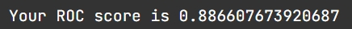

# Stepik ML contest

## Description
This project is a part of Stepik course "Introduction to Data Science and machine learning". The task is to analyze users activity in another Stepik course and predict whether the user is going to complete the course based on his activity during the first two days of education. We assume that person has completed the course if he has more then 40 correctly done 'steps'.
We are given two datasets:
- events_train - data about users actions on 'steps'. Brief description of the dataset:
  - step_id
  - used_id
  - timestamp - action time
  - action - one of four possible actions:
    - discovered
    - viewed
    - started_attempt
    - passed
- submissions_train - data about users submits of the 'steps'. Brief description of the dataset:
  - step_id
  - timestamp - submit time
  - submission_status:
    - correct
    - wrong
  - user_id

## Result

